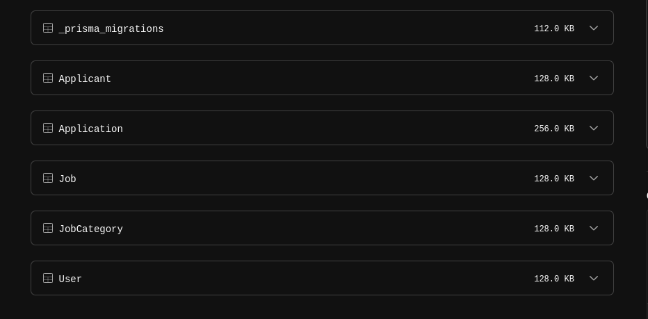

# Hiring Agency API Backend 🦺


Developed by <a href="https://github.com/sean-code" target="_blank">Sean Nganga</a> courtesy of Grannex 11/2023

- <a href="https://www.postman.com/vlapp-emmerce/workspace/graffix-workspace/collection/26841432-c5a587c9-e394-4442-a479-64102c0791b1?action=share&creator=26841432&active-environment=26841432-d174213c-8355-4d3a-9cc9-5ea6d8f19baf" target="_blank">POSTMAN Workspace</a>

## Technologies used 🧑‍💻

- Prisma (ORM)
- MYSQL (Database)
- Node JS (Backend Framework)
- Express
- JavaScript (Language)
- PlanetScale (Database Provider)
- Render (Backend Deployment Web Service)


## Description 📝

- <a href="https://www.postman.com/vlapp-emmerce/workspace/graffix-workspace/collection/26841432-c5a587c9-e394-4442-a479-64102c0791b1?action=share&creator=26841432&active-environment=26841432-d174213c-8355-4d3a-9cc9-5ea6d8f19baf" target="_blank">POSTMAN Workspace</a>

This project is a Node.js application that utilizes the Prisma ORM to interact with a MySQL database. This project is part of a backend development assessment exercise for a hiring agency system. It focuses on tracking job opportunities and applicants, providing a robust and efficient backend built with Node.js, Express, and Prisma. The system allows for managing job openings, applicant details, and job applications.

This was achieved through 4 models (JobCategories, Jobs, Applicants, and Applications), and also the 5th User model for the purpose of Authentication.

- <a href="https://www.postman.com/vlapp-emmerce/workspace/graffix-workspace/collection/26841432-c5a587c9-e394-4442-a479-64102c0791b1?action=share&creator=26841432&active-environment=26841432-d174213c-8355-4d3a-9cc9-5ea6d8f19baf" target="_blank">POSTMAN Workspace</a>

### Key Features Done: ✅


#### Required

* Job Openings Management: API endpoints to add, list, update and update job openings, and storing details in MYSQL database.
* Applicant Tracking: Capabilities to register, list, update, and delete applicants including personal details, job applications, and resume links, and save to MYSQL database.

* Applicant and Job Details Retrieval: Full CRUD actions Endpoints to fetch and display lists of applicants and the jobs they have applied for.


#### Optional functionality

-- Following are implemented to enhance security

  * UUID as Primary Key - UUID consists of 32 hex digits separated by four dashes, which makes it quite challenging to remember. At some level this relieves the vulnerability of data manipulation.

  * Authentication - signup and login helps protect all routes used in this API. You have to be registered in the system through sign up, so then you can access login, and eventually through login you can have access to all other endpoints.  

  * JWTs - JSON Web Tokens implementation makes the API secure because they contain a signature that can be verified to ensure validity. 


  * Password Encryption using Bcrypt - Bcrypt encryption of passoword is essential because it the password is saved in the db in a salted format. 


#### General Overview
* Applicants Management: ...

* Jobs Management: ...

* Express.js Web Server: The application is built using Express.js, providing a web server for handling API requests.

* Prisma ORM: Prisma is used as the ORM to interact with the MySQL database, making it easy to work with your data models.

This project provides a solid foundation for building a web application that manages user and perfume data. You can easily extend and customize it to suit your specific requirements.


## Consuming API Endpoints with Postman 🧐

### Setting Up / Signup
1. Open this <a href="https://www.postman.com/vlapp-emmerce/workspace/graffix-workspace/collection/26841432-c5a587c9-e394-4442-a479-64102c0791b1?action=share&creator=26841432&active-environment=26841432-d174213c-8355-4d3a-9cc9-5ea6d8f19baf" target="_blank">POSTMAN Workspace</a> on your device
2. Open the Auth Folder and click on POST Register New User. Fill in the request body with your chosen email and password in JSON format:
    ```
    {
      "email": "yours@example.com",
      "password": "your-password"
    }
    ```
3. Send the request by clicking the "Send" button

### Login and Retrieve Token

1. Click on "POST Login User" under the "Auth" collection
2. Enter the same email and password you registered with in the request body.
3. Send the request. You will receive a JSON response with a Bearer token. Copy this token.

### Set the Bearer Token
1. Click on the "Auth" collection in the sidebar Select the "Authorization" tab in the right-hand pane.
2. Set the type to "Bearer Token".
3. Paste the copied token into the "Token" field. Click "Save".


Your token is now set for all requests within the "Auth" collection. Since the token expires after 30 minutes, you may need to log in again to refresh the token if it expires.

You can now Consume all Other Endpoints in the Postman Workspace


## Available Endpoints 🏷️

From baseUrl prefix https://graffix-jobsapi.onrender.com/api , the following are the endpoints: 


-  User Authentication Routes
```
POST /api/register - Register a new user.
POST /api/login - Login for existing users.
```

- Job Routes
```
POST /api/jobs - Create a new job.
GET /api/jobs - Retrieve all jobs.
GET /api/jobs/:id - Retrieve a specific job by its ID.
PUT /api/jobs/:id - Update a specific job by its ID.
DELETE /api/jobs/:id - Delete a specific job by its ID.
```

- JobCategory Routes

```
POST /api/jobCategories - Create a new job category.
GET /api/jobCategories - Retrieve all job categories.
GET /api/jobCategories/:id - Retrieve a specific job category by its ID.
PUT /api/jobCategories/:id - Update a specific job category by its ID.
DELETE /api/jobCategories/:id - Delete a specific job category by its ID.
```


- Applicant Routes
```
POST /api/applicants - Create a new applicant.
GET /api/applicants - Retrieve all applicants.
GET /api/applicants/:id - Retrieve a specific applicant by its ID.
PUT /api/applicants/:id - Update a specific applicant by its ID.
DELETE /api/applicants/:id - Delete a specific applicant by its ID.
```

- Application Routes

```
POST /api/applications - Create a new application.
GET /api/applications - Retrieve all applications.
GET /api/applications/:id - Retrieve a specific application by its ID.
PUT /api/applications/:id - Update a specific application by its ID.
DELETE /api/applications/:id - Delete a specific application by its ID.
GET /api/applications/job/:jobId - Retrieve applications by a specific Job ID.
GET /api/applications/applicant/:applicantId - Retrieve applications by a specific Applicant ID.
```


## Some Screenshots 📸

- MYSQL DB Tables
    <br>
  


- Prisma Studio View
  <br>
  


- Folder Architecture
  <br>
  


- Job Categories
    <br>
  

- Jobs
    <br>
  


- Access Without Auth
    <br>
  


* And So much more to explore...


## Known Bugs 🐛

So far so good there are no bugs related to this project 😎

## Support and contact details 🙂

To make a contribution to the code used or any suggestions you can click on the contact link and message me your suggestions.

- Telegram: https://t.me/sean_code

## MIT License 🛂

Copyright (c) 2023 Sean

Permission is hereby granted, free of charge, to any person obtaining a copy
of this software and associated documentation files , to deal
in the Software without restriction, including without limitation the rights
to use, copy, modify, merge, publish, distribute, sublicense, and/or sell
copies of the Software, and to permit persons to whom the Software is
furnished to do so, subject to the following conditions:

The above copyright notice and this permission notice shall be included in all
copies or substantial portions of the Software.

THE SOFTWARE IS PROVIDED "AS IS", WITHOUT WARRANTY OF ANY KIND, EXPRESS OR
IMPLIED, INCLUDING BUT NOT LIMITED TO THE WARRANTIES OF MERCHANTABILITY,
FITNESS FOR A PARTICULAR PURPOSE AND NONINFRINGEMENT. IN NO EVENT SHALL THE
AUTHORS OR COPYRIGHT HOLDERS BE LIABLE FOR ANY CLAIM, DAMAGES OR OTHER
LIABILITY, WHETHER IN AN ACTION OF CONTRACT, TORT OR OTHERWISE, ARISING FROM,
OUT OF OR IN CONNECTION WITH THE SOFTWARE OR THE USE OR OTHER DEALINGS IN THE
SOFTWARE.


